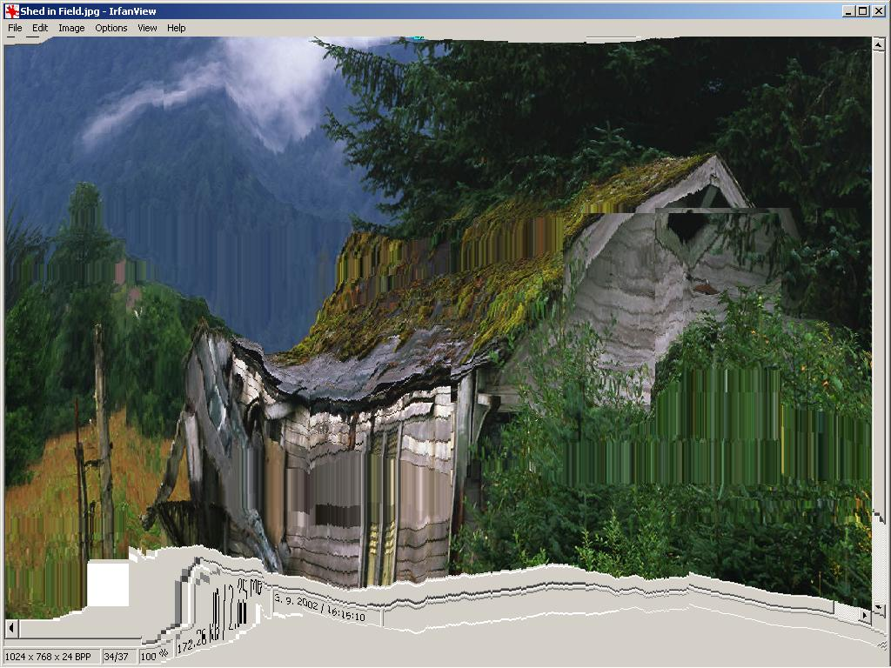



## An screen deformer \- please look at the screenshot\!

### Description

Hi this code just uses SetLayeredWindowAttributes and then moves a picturebox. The effect is quite nice... Win2K and XP only. If you like it then please leave comments or vote.
 
### More Info
 
Screen deformation

             |
---                |---
**Submitted On**   |2003-03-23 00:02:18
**By**             |[Viliam Kubis](https://github.com/Planet-Source-Code/PSCIndex/blob/master/ByAuthor/viliam-kubis.md)
**Level**          |Advanced
**User Rating**    |4.3 (13 globes from 3 users)
**Compatibility**  |VB 6\.0
**Category**       |[Graphics](https://github.com/Planet-Source-Code/PSCIndex/blob/master/ByCategory/graphics__1-46.md)
**World**          |[Visual Basic](https://github.com/Planet-Source-Code/PSCIndex/blob/master/ByWorld/visual-basic.md)
**Archive File**   |[An\_screen\_16725011162003\.zip](https://github.com/Planet-Source-Code/viliam-kubis-an-screen-deformer-please-look-at-the-screenshot__1-49937/archive/master.zip)

